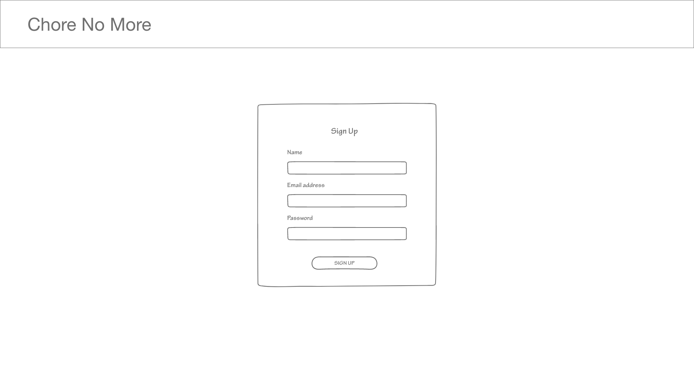

# Wireframes

Here is an explanation of each view of the applications. There are additional wireframes supplied such as [Home Page - Next Week](./Home%20Page%20%E2%80%93%20Next%20Week.png) which are not explained here are they are only present to simulate interactivity in the Adobe XD interface.

## Signup

A simple signup page to create a new account.

## Login

A similarly simple login page for once you have made an account.

## Home Page

A home page showing a calendar (top left), household members (bottom left), and the list of chores in your household (right).

### Add Chore Menu

This menu, accessible by pressing the "add chore" button on the home page, allows you to create new chores, setting due dates, assigning users, and modify other miscellaneous settings.

### Assign Chores Menu

This menu is accessible by pressing the "assign chores" button. It allows you to select a subset of the hcores in a household and cycle the chores between the different users of your household.

### Add Member Menu

The add member menu, accessible by pressing the "add member" button on the home page allows you to either invite an "adult" account via email or add a child account by entering their name and pin. 

### Manage Household Menu

This menu, accessible by pressing the "manage household" button on the home screen, allows you to remove members from the household by pressing the trashcan button next to their name, then pressing "submit" to confirm this action.

## Profile Page

This page, accessible by pressing your profile picture on the top right of the screen, lets you change how you appear to your housemates, as well as change your email address for notifications and logging in.

## User History View

This view, accessible at any point by clicking on a profile picture of a user in the main content of a page, shows you the current status of chores a user has completed. For example, if there is a weekly chore that is due later this week the user has not completed, it will show as "uncompleted", and if the user then marks that as completed, it will move to "completed."

## Day View

The day view, accessible by pressing any date on the calendar, allows you to get a view of what times of days chores were completed and are supposed to be completed by.

